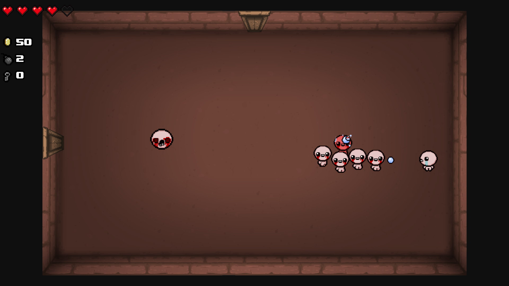

# The Binding of Isaac - Pygame project
#### Recreation of "The Binding of Isaac: Rebirth" game, done solely using Pygame.
#### I am working on this project with the aim of becoming better at using Python and programming in general.
###### The original game: https://store.steampowered.com/app/250900/The_Binding_of_Isaac_Rebirth/

## Table of Contents
* [General info](#general-info)
* [Technologies](#technologies)
* [Setup](#setup)

## General info
The project is a 2D game that spawns the player on a randomly generated map, where they can explore the rooms and find various types of enemies with different behaviours and items that grant unique effects.
The goal is to defeat the boss, that is chosen randomly from the few available. 

## Technologies
#### The project is created with:
* Python 3.12.2
* Pygame 2.6.1

## Setup
1. Clone the repository
```
git clone https://github.com/michnom/isaac.git
```
2. Set up virtual environment (optional)
```bash
# Create a virtual environment
python -m venv venv

# Activate the virtual environment (Windows)
venv\Scripts\activate

# Activate the virtual environment (Linux/macOS)
source venv/bin/activate
```
3. Run the game
```bash
main.exe
```
#### Alternatively
3. Install dependencies (only Pygame)
```bash
pip install pygame
```
4. Run the game
```bash
python main.py
```

## Structure
### Game logic:
* **main.py** - The main file, contains game logic and controls.
* **eventHandler.py** - Manages the events, that are happening in the game.
* **src/map.py** - Responsible for creating map layout, rooms, and a couple of other objects.
* **src/player.py** - Contains all information about the player, player animations, damage taking, movement, shooting and collisions.
* **src/enemy.py** - Manages all enemies movement, shooting, behaviour, damage taking, animations and collisions.
* **src/projectile.py** - Responsible for projectiles movement and damage.
* **src/room.py** - Updates all the objects inside of it, places doors, spawns items and enemies.
* **src/item.py** - Creates items, applies their effects and animates them.
* **src/door.py** - Creates doors, opens, closes and animates them.

### Graphical Interface:
* **src/gui.py** - Creates player and boss healthbars, pickup counters, pause screen, item description animations and font outlines.

### Additional Files
* **settings.py** - Containins the initial window width, height and debug mode toggle.
* **globals.py** - Stores the dynamic window size.
* **src/spritesheet.py** - Allows to divide spritesheets into even tiles and then returns the requested tile as a ready-to-use sprite.
* **src/items.py** - Stores the names, attributes, statistics and descriptions of all the available items in the game.
* **src/enemies.py** - Stores the names of regular enemies and bosses.


## Info
To unlock cheats (teleporting, more money, better stats, enemy clearing), change "debug_mode" variable in settings.py to "True" (requires launching via python main.py).
### Controls
* **WASD** - Moving the character.
* **Arrow Keys** - Shooting.
* **F** - Toggle fullscreen.
* **Escape** - Pause menu.
* **Enter/Space** - Start the game when in Main Menu.

## Gallery
#### Starting room

#### Fighting

#### Shop

#### Boss fight


## Credits
Big thanks to the official "The Binding of Isaac: Rebirth" team for inspiring me to make this project and develop as a programmer!
